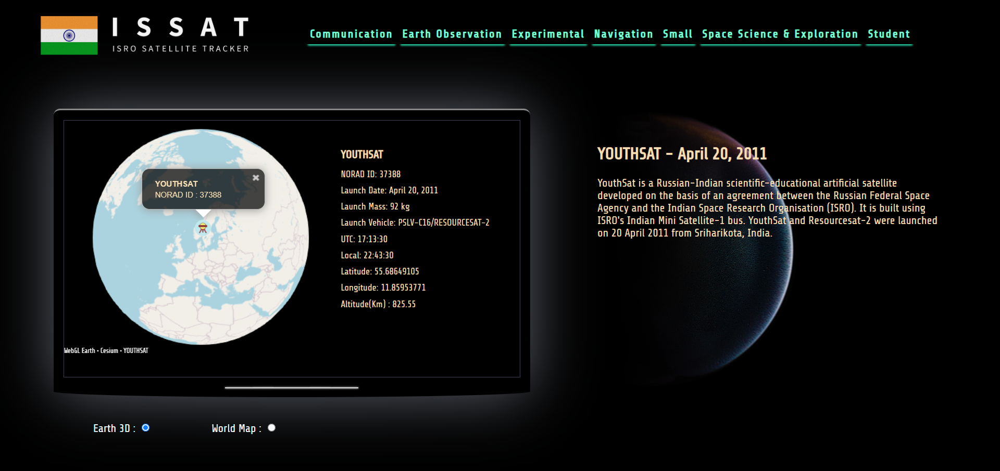

# ISSAT - ISRO Satellite Tracker 
ISSAT is an open-source satellite tracking application that allows users to track the position of ISRO satellites in real-time. This project is built using Python and leverages the N2YO API and ISRO for satellite data and map visualization. ISSAT provides a user-friendly interface for selecting specific ISRO satellites and tracking their position over time.

## Demo Video

https://user-images.githubusercontent.com/59118402/221426968-153ae0eb-7e27-40ed-b96b-772079bf603f.mp4

Features:

* Real-time tracking of ISRO satellites
* Satellite position and trajectory visualization on a map
* Select specific satellites to track
* User-friendly interface
* Built with Python and open-source APIs

## Getting Started 

### Prerequisites
* Python 3.x
* pip

### Installation
1. Clone the repository: git clone https://github.com/rohitkrtiwari/ISSAT.git
2. Navigate to the project directory: cd ISSAT
3. Install the required packages: pip install -r requirements.txt

### Usage
1. Run the ISSAT application: python ISSAT.py
2. Select a satellite from the dropdown menu
3. Use the map to track the satellite's position in real-time

### Contributing
Contributions to this project are welcome and encouraged.

### Acknowledgments

This project was inspired by the amazing work being done at ISRO and the many open-source contributors who have built similar satellite tracking applications.

I hope this README file provides helpful information on how to get started with your ISRO Satellite Tracker project, including installation and usage instructions. Best of luck with your project!

## 🔗 Links

